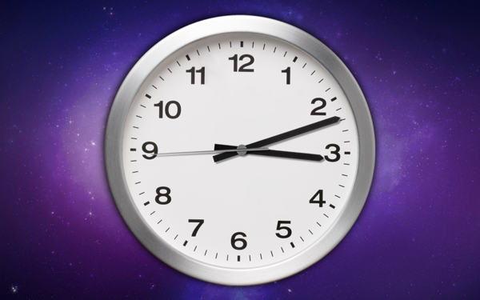

AnalogClock
===========

AnalogClock is a ScreenSaver on Mac OS X.

## Preview

## Install

- download the AnalogClock from [here]()
- double click AnalogClock.screensaver, and enjoy it

## Configure

There are three option for AnalogClock.

- Gallery Path: 
- Recursion:
- Editor Panel:

## Licence

Licenced under the MIT Licence.
 
## Support

- if you have any idea for AnalogClock, submit to issues
- ok, Any apps likely to be bugs, so, if you find them, submit to issues